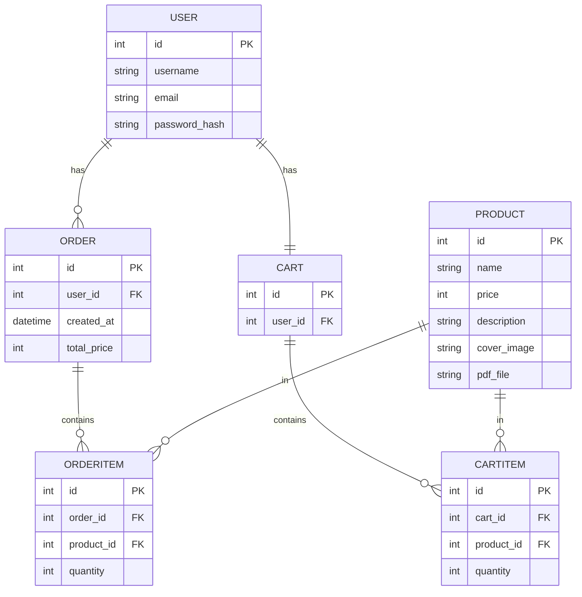

# オンラインPDF販売ECサイト 設計書

## 1. ディレクトリ構成

```
sample-EC/
├── app/
│   ├── __init__.py
│   ├── models.py
│   ├── routes/
│   │   ├── auth.py
│   │   ├── product.py
│   │   ├── cart.py
│   │   ├── order.py
│   │   └── download.py
│   ├── templates/
│   │   ├── register.html
│   │   ├── login.html
│   │   ├── product_list.html
│   │   ├── product_detail.html
│   │   ├── cart.html
│   │   ├── checkout.html
│   │   ├── order_complete.html
│   ├── static/
│   │   ├── images/
│   │   └── css/
├── config.py
├── run.py
├── requirements.txt
├── 要件定義.md
└── 設計書.md
```

---

## 2. モデル設計（DBテーブル）

| モデル名      | 主なフィールド                                      | 説明                       |
|---------------|----------------------------------------------------|----------------------------|
| User          | id, username, email, password_hash                 | ユーザー情報               |
| Product       | id, name, price, description, cover_image, pdf_file| 商品（PDF書籍）情報        |
| Cart          | id, user_id                                        | ユーザーごとのカート       |
| CartItem      | id, cart_id, product_id, quantity                  | カート内の商品             |
| Order         | id, user_id, created_at, total_price               | 注文情報                   |
| OrderItem     | id, order_id, product_id, quantity                 | 注文内の商品               |

---

## 3. ルーティング設計

| ルートURL                | HTTPメソッド | 機能概要                       | 実装ファイル         |
|-------------------------|--------------|-------------------------------|----------------------|
| /register               | GET/POST     | ユーザー登録                   | app/routes/auth.py   |
| /login                  | GET/POST     | ログイン                       | app/routes/auth.py   |
| /logout                 | GET          | ログアウト                     | app/routes/auth.py   |
| /products               | GET          | 商品一覧表示                   | app/routes/product.py|
| /products/<id>          | GET          | 商品詳細表示                   | app/routes/product.py|
| /cart/add/<product_id>  | POST         | カートに追加                   | app/routes/cart.py   |
| /cart                   | GET          | カート内容表示                 | app/routes/cart.py   |
| /checkout               | GET/POST     | 購入手続き                     | app/routes/order.py  |
| /order/complete/<id>    | GET          | 購入完了画面                   | app/routes/order.py  |
| /download/<order_item_id>| GET         | PDFダウンロード                | app/routes/download.py|

---

## 4. 画面設計

| 画面名             | 主な表示内容・操作項目                       | テンプレートファイル         |
|--------------------|----------------------------------------------|-----------------------------|
| ユーザー登録画面   | ユーザー名、メール、パスワード入力欄         | register.html                |
| ログイン画面       | メール、パスワード入力欄                     | login.html                   |
| 商品一覧画面       | 商品名、価格、表紙画像、詳細リンク            | product_list.html            |
| 商品詳細画面       | 商品名、価格、表紙画像、説明                  | product_detail.html          |
| カート内容画面     | カート内商品一覧、合計金額                    | cart.html                    |
| 購入手続き画面     | 購入商品一覧、合計金額、決済情報入力欄        | checkout.html                |
| 購入完了画面       | 購入完了メッセージ、ダウンロードURL            | order_complete.html          |

---

## 5. データベース設計（ER図：mermaid）



---

## 6. 設定ファイル

- config.py: Flask設定、DB接続情報（MySQL）

---

## 7. 使用技術・ライブラリ

- Python 3.x
- Flask
- Flask-SQLAlchemy
- Flask-Login
- mysqlclient

---

## 8. 今後の拡張案

- 商品管理画面（管理者用）
- レコメンド機能
- レビュー機能
- UI/UX改善
- 決済API連携（Stripe等）

---

以上が本システムの設計書です。
