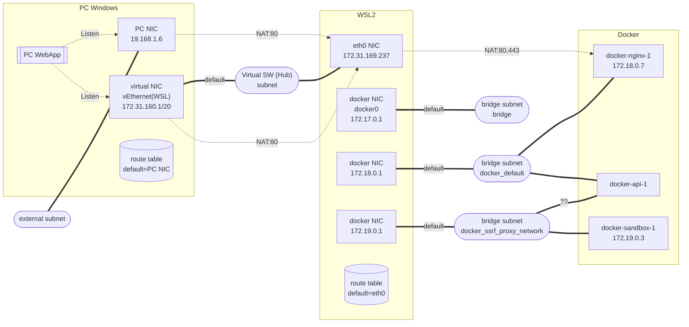

# INSTALL
https://docs.dify.ai/ja-jp/getting-started/install-self-hosted/docker-compose

## Install WSL2
https://learn.microsoft.com/en-us/windows/wsl/install

1. install
    ```powershell
    # (Run as administrator)

    # install wsl
    wsl --install Ubuntu
    #wsl --list --online

    #if error occur in above installation process:
    #dism.exe /online /enable-feature /featurename:Microsoft-Windows-Subsystem-Linux /all /norestart
    #dism.exe /online /enable-feature /featurename:VirtualMachinePlatform /all /norestart
    #shutdown /r /t 0

    # check wsl version (must be 2)
    wsl -l -v
    #wsl --set-version Ubuntu 2
    ```
2. setting
    - create admin user/password for Ubuntu
    - proxy setting for WSL2
      * https://qiita.com/dkoide/items/ca1f4549dc426eaf3735
      * https://zenn.dev/wsuzume/articles/f9935b47ce0b55
      ```bash
      # /etc/environment (env. vars. for all users and processes)
      HTTP_PROXY=http://proxy.xxx.com:xxx
      http_proxy=http://proxy.xxx.com:xxx
      HTTPS_PROXY=http://proxy.xxx.com:xxx
      https_proxy=http://proxy.xxx.com:xxx
      NO_PROXY=127.0.0.1,localhost
      no_proxy=127.0.0.1,localhost
      ```
  3. check network on WSL2
      ```
      curl http://www.google.com
      sudo curl http://www.google.com
      ```


## Install Docker Engine on WSL2
https://docs.docker.com/engine/install/ -> select "Ubuntu"

* Since commercial use of Docker Desktop in larger enterprises 
  requires a paid subscription, we use Docker Engine instead.

1. Install docker engine 
    - Do the things in "Install using the apt repository" in https://docs.docker.com/engine/install/ubuntu/
    - if failed at `sudo docker run hello-world`, i.e., `docker pull` failed,
      ```bash
      sudo vi /etc/systemd/system/docker.service.d/override.conf  # add the followings
            [Service]
            Environment="HTTP_PROXY=http://proxy.example.com:xx"
            Environment="HTTPS_PROXY=http://proxy.example.com:xx"
      sudo systemctl daemon-reload
      sudo systemctl restart docker
      sudo docker info  # to check proxy setting for docker pulling
      ```
    - if failed at others,
      - add to curl proxy option: --proxy http://proxy.xxx.com
      - add to apt-get proxy option: -o Acquire::http::Proxy="http://proxy.xxx.com"
      - add to docker run proxy optin: -e HTTPS_PROXY=http::Proxy=http://proxy.xxx.com

1. install docker compose
    - follow "Install using the repository" in
      https://docs.docker.com/compose/install/linux/#install-using-the-repository
      ```bash
      sudo apt-get update
      sudo apt-get install docker-compose-plugin
      docker compose version

      sudo systemctl status docker
      #sudo systemctl restart docker
      #sudo systemctl stop docker
      ```
* proxy setting for Docker
  * https://qiita.com/dkoide/items/ca1f4549dc426eaf3735
  * https://zenn.dev/wsuzume/articles/f9935b47ce0b55


## install Dify
https://docs.dify.ai/ja-jp/getting-started/install-self-hosted/docker-compose

```bash
# install
#git config --global http.proxy http://proxy.xxx.com
#git config --global https.proxy http://proxy.xxx.com
git clone https://github.com/langgenius/dify.git
cd dify/docker
cp .env.example .env
```    

## run Dify
```bash    
cd dify/docker
sudo docker compose up -d
# -> access with browser http://localhost
```    
```bash
#check if Dify running
sudo docker compose ps
```
## Setting Network

### Overview



- listen 0.0.0.0 == listen all NICs in the host
- check all NICs in the host
  - `PS> ipconfig` 
  - `WSL> ip addr`
- check routing table of the host
  - `PS> route print`
  - `WSL> ip route`
- check network (IP address and subnet) of Docker container
  - `sudo docker network ls`
  - `sudo docker inspect docker-nginx-1`

### Port mapping (NAT): WSL2 to docker container "nginx"
  * mapping is specified in ports section of nginx in docker-compose.yaml
  * default:  0.0.0.0:80->80, 0.0.0.0:443->443
      * Mapping port 80 of WSL2 NICs to port 80 of docker container "nginx" 
  * check port mapping of nginx
    ```bash
    sudo docker compose ps -a
    ```
  * check listen ports in WSL2
    ```bash
    sudo lsof -i -nP
    ```
  * test access from docker container
    ```bash
    # start Web server in WSL2
    python3 -m http.server 999 &
    # start docker curl with removing container after command finish
    sudo docker run --rm curlimages/curl http://IPaddr_of_eth0:999
    ```

### Port mapping (NAT):  Host PC to WSL2
  -  https://rcmdnk.com/blog/2021/03/01/computer-windows-network/
  -  https://qiita.com/yururu_no_yu/items/1fe94eeff12bad910d58
  -  https://qiita.com/omu_kato/items/f9a6b5a02e25f5f2a487
  - https://zenn.dev/yamamoto_11709/articles/1e90bc9f7b7500
  - https://scrapbox.io/hotchpotch/WSL2_%E7%92%B0%E5%A2%83%E3%81%B8%E3%81%AE_port_forwarding
  * Default fowarding: Any TCP port you listen on inside WSL2 is automatically forwarded to the Windows host’s localhost on the same port.
  * If you want use Dify from external client, do followings.
  * Note that WLS2 eth0 address is changed per startup.

  1. Set port forwarding
      ```powershell
      # check IP address of WSL2 eth0
      wsl -e ip addr show eth0
      # get IP addr of eth0
      $ip = wsl -e ip addr show eth0 | where { $_ -match "inet "} |  foreach { ($_ -split "[\s/]+")[2] }
      # delete old port forwarding
      netsh interface portproxy delete v4tov4 listenport=80 listenaddress=0.0.0.0
      # set port forwarding
      netsh interface portproxy add v4tov4 listenaddress=0.0.0.0 listenport=80   connectaddress=$ip connectport=80
      # show port forwarding
      netsh interface portproxy show v4tov4
      ```
  2. Setting firewall 
      * open port 80 by Windows Defender Wirewall
      * https://support.borndigital.co.jp/hc/ja/articles/360002711593-Windows10%E3%81%A7%E7%89%B9%E5%AE%9A%E3%81%AE%E3%83%9D%E3%83%BC%E3%83%88%E3%82%92%E9%96%8B%E6%94%BE%E3%81%99%E3%82%8B
      ```powershell
      # set firewall
      netsh advfirewall firewall add rule name="★Dify TCP 80" dir=in action=allow protocol=TCP localport=80 profile=private,domain
      # show firewall
      netsh advfirewall firewall show rule name="★Dify TCP 80"
      # delete firewall
      netsh advfirewall firewall delete rule name="★Dify TCP 80"
      ```

      * To delete all port forwarding: `netsh.exe interface portproxy reset`

  3. Test access Dify from host PC or external PC:
      * `http://IP_address_of_host_or_hostname:80`

  * To check listen ports in Host
      ```
      netstat -ano | grep LISTEN
      ```

# Dify Setting

### LLM setting
- Settings —> Model Providers
  1. install model provder,
  2. setting endpoint, API key, etc.

  * If failed to install model providers,
    - Download plugin pkg file from Dify Marketplace, and install it by Dify GUI: https://github.com/langgenius/dify/issues/14776
    - if the above failed,
      * (it may be better to delete this setting after installing model proiders)
      * vi docker-compose.yaml
        - https://qiita.com/k-hideo/items/d1cc1f3efff9d068dee7
        - add PROXY setting to `plugin_daemon` section
          ```
          ...
          plugin_daemon:
          image: langgenius/dify-plugin-daemon:0.2.0-local
          restart: always
          environment:
            # Use the shared environment variables.
            <<: *shared-api-worker-env
            HTTP_PROXY: http://proxy.xxx.com:xxx
            HTTPS_PROXY: http://proxy.xxx.com:xxx
            NO_PROXY: localhost,127.0.0.1,weaviate,qdrand,db,redis,web,worker,plugin_daemon,plugin
            ...
          ```
      - To see log from model provider installation process,
        - `sudo docker logs -f docker-plugin_daemon-1`
        - maybe, failed when installing python modules dependent on the provider plugin.

- When endpoint is local, 
  - LLM endpoint server should listen 0.0.0.0
  - Specify endpoint as IP address of host: http://IP_of_host:port/   

### Others
- Settings -> languages -> timezone

### User Account for community version
- login with mail address and password

# Using Dify

### Invoke Workflow by Web API
- [ワークフローアプリ API](http://meia9dbc/app/8f3847a8-155c-4615-90d9-8e5b45fef4cd/develop)
- API Key:  Setting in Left Pain in app in Studio
- API format: API Access in Left Pain in app in Studio


# Text Embedding Model (for RAG)

### ruri-large model
https://docs.dify.ai/en/development/models-integration/ollama#integrate-local-models-deployed-by-ollama
1. install ollama in Windows
    * -> start Ollama in background
2. change listen address:  default localhost -> 0.0.0.0
    1. click Ollama icon in task tray
    2. click Setting -> Check "Expose Ollama to the network"
3. install uri-large model
    ```powershell
    # download
    ollama pull kun432/cl-nagoya-ruri-large
    ollama list  # list pulled models
    # start running model
    curl http://localhost:11434/api/embed -Method Post -ContentType application/json -Body '{
      "model": "kun432/cl-nagoya-ruri-large",
      "input": "文章: 日本のAI技術の進展について教えてください。"
    }'
    # check models running
    ollama ps
    # stop model
    ollama stop kun432/cl-nagoya-ruri-large
    ```
5. Setting Firewall
      ```powershell
      # set firewall
      netsh advfirewall firewall add rule name="★Ollama TCP 11434" dir=in action=allow protocol=TCP localport=11434 profile=private,domain
      # show firewall
      netsh advfirewall firewall show rule name="★Ollama TCP 11434"
      # delete firewall
      netsh advfirewall firewall delete rule name="★Ollama TCP 11434"
      ```
6. Ollama starts an API service at:
    * default: `http://localhost:11434`
    * setting OLLAMA_HOST: `http://$OLLAMA_HOST:11434`

# WSL2 Disk

### 
https://learn.microsoft.com/ja-jp/windows/wsl/disk-space
https://qiita.com/siruku6/items/c91a40d460095013540d

* Check the amount of disk space available in the VHD for a Linux distribution
  ```
  wsl.exe --system -d ubuntu df -h /mnt/wslg/distro
  ```
* get VHD file path name and its size
  ```
  # get VHD file path
  $vhd = Get-ChildItem -Path HKCU:\Software\Microsoft\Windows\CurrentVersion\Lxss | foreach { $_.GetValue("BasePath") + "\" + $_.GetValue("VhdFileName")}
  # check size of used disk
  ls $vhd
  ```
    * basically VHD file size = used disk size in Ubuntu.
    * but even if reduce used disk in ubuntsu, the file size not reduced.
* To shrink disk in such case
  ```
  wsl --shutdown
  diskpart
    select vdisk file="file/path/to/$vhd"
    attach vdisk readonly
    compact vdisk
    detach vdisk
    exit
  ```

# MCP server
https://docs.dify.ai/ja-jp/plugins/best-practice/how-to-use-mcp-zapier
https://zenn.dev/upgradetech/articles/24a7d76133af4c
## Setting
1. Difyプラグインマーケットプレイスで「MCP SSE」プラグインを検索・インストール
1. 「MCP SSE」プラグインを開き「認証する」ボタンをクリックし、登録したいMCPサーバーのconfig(URLなど)を設定
    - 設定内容：https://marketplace.dify.ai/plugins/junjiem/mcp_sse?theme=dark
    - config例
    ```
    {
      "microsoft_docs_mcp": {
        "transport": "streamable_http",
        "url": "https://learn.microsoft.com/api/mcp"
      }
    }
    ```
1. DifyのアプリにMCPツールを設定する
    - エージェントアプリの場合
      1. Difyエージェントアプリを開き、[ツール]の[追加]を押し、以下を設定する
        - MCP Tools -> Fetch MCP tools
        - MCP Tools -> Call MCP tool
    - ワークフローアプリの場合
      1. [エージェント]ノードを追加して開く
      1. エージェンティック戦略　に、MCP FunctionCalling を設定
        - MCP Agent Strategyプラグインをインストールしておく
      1. MCP Server URLを設定する
    - エージェントノードでは現時点で HTTP 型の MCP プラグインは利用できません。
      -  HTTP 呼び出しノードを作成し、エージェントアプリをWebAPIで呼び出す
      ★まだ未実施
      
- Instruction (System Prompt)の例
  ```
  使用可能なMCPツールのリストを表示してください。
  ```
- Instruction (System Prompt)の例
  ```
  Userの指示に従い適切なツールを使用してください。
  今日の日付を取得する際には、CurrentTimeを使ってください。
  昨日や明日や明後日などの日付を取得する際にはCurrentTimeから計算を行い取得してください。
  曜日について指示があった際にはWeekday Calculatorを用いて計算してください。
  予定について尋ねられた際にはzapier_mcpから得られるGoogle Calendar情報を用いて予定を取得してください。
  日付を指定されている場合その日以外の予定は送信しないでください。
  予定についてはカレンダーに書いている情報以外は書かないでください。
  送信は行わなくてよいです。
  出力は質問内容への解答だけでいいです。
  ```
  