<!-- _class: opening -->
 
# Marp サンプル
 

### theme: my-theme

---

## About Marp

### 公式
- Marpit: 基盤ライブラリ：　https://marpit.marp.app/
- Marp: アプリケーション群：　https://marp.app/

### VS Code Extension
- Marp for VS Code

### テンプレート・サンプル
- https://qiita.com/tomo_makes/items/aafae4021986553ae1d8
- https://qiita.com/zono_0/items/e6ab64f381440578ea1c

  
---

<!-- _class: table5-->

## テーブル・見出し・箇条書き

### 体制図
| 役割 | 担当者 | 責任範囲 |
| :--- | :--- | :--- |
| プロジェクトマネージャー | [PM名] | 全体管理、進捗、課題管理 |
| テックリード | [リード名] | 技術選定、設計、コードレビュー |
| 開発担当 | [開発者名] | 機能実装、テスト |

 

### 見出し3
#### 見出し4
- **定例会議:** 毎週月曜日 10:00-10:30
  - **連絡ツール:** Slack, Google Meet
    - その他

---
## スタイル・記号 (1/2)

### スタイル
- 全ページ共通：　``
- ページ独自：　``

### 記号文字

line_end_arrow_notch
arrow_forward double_arrow chevron_right

### グリッド

aa

double_arrow

bb

  ### aaa
  cxx

arrow_forward

### bbb
bbb
ccc

---
## スタイル・記号 (2/2)

### 2カラム

aa
- bb
- cc

xx
yy

| 種別 | 内容 | 日付 |
|---|---|---|
| 危険 | データ破壊 | 2025/5/6 |

---
## Draw.io

- Draw.io
  - https://www.drawio.com/
- VScode extension "Draw.io Integration"
  - [marketplace](https://marketplace.visualstudio.com/items?itemName=hediet.vscode-drawio)
  - [guthub](https://github.com/hediet/vscode-drawio)
  - by default, offline version of drawio is used

- To use
  - Edit
  - Save as .svg
  - ``

drawio.svg

---
## Mermaid

- Mermaid
  - https://mermaid.js.org/
  - https://www.mermaidchart.com/
- VScode extensions
  - [Mermaid Chart](https://github.com/Mermaid-Chart/vscode-mermaid-chart)
    - connecting to cloud marmaidchart.com
  - [Mermaid Editor](https://marketplace.visualstudio.com/items?itemName=tomoyukim.vscode-mermaid-editor)
    - 100% local solution
    - work on .mmd file, export to svg
    - To use: Edit, Save as .svg, and ``
  - "Markdown preveiw Mermaid Suport"
    - offline
    - work on code block in .md file, cannot save
  - Mermaid Markdown Syntax Highlighting

mermaid.svg

---

## Kroki

- Kroki
  - https://kroki.io/
- VScode Kroki extension
  - [marketplace](https://marketplace.visualstudio.com/items?itemName=pomdtr.markdown-kroki)
  - [guthub](https://github.com/pomdtr/vscode-markdown-kroki)
  - connecting to cloud server by default, but can install server in local

- To use
  - This extension cannot save diagam...

---

# Design Guideline
## このテンプレートを美しく保つためのルール

---

## スライドタイトル (`##`) のルール

### **原則: 必ず1行に収めること**
タイトルが2行になると、後続のコンテンツと重なり、レイアウトが完全に崩れてしまいます。これは最も重要なルールです。

### **目安: 全角30文字以内**
簡潔で分かりやすいタイトルを心がけてください。

 

#### 悪い例 (Bad) 
`## このプロジェクトにおける非常に重要な技術的負債とその具体的な返済計画に関する長大な考察`
（長すぎて改行され、レイアウトが崩れます）

---

## 本文・箇条書きのルール

### **原則: 1スライド・1メッセージ**
1枚のスライドに情報を詰め込みすぎず、聞き手が集中できるよう、最も伝えたいメッセージを1つに絞りましょう。

### **推奨するレイアウトと文字量**
- **1行あたりの文字数:** **全角35〜45文字**
  - これを超えると視線の移動が大きくなり、読みにくくなります。適度な位置で改行を入れましょう。
- **箇条書きの項目数:** **5〜7個**まで
- **各項目の行数:** **1〜2行**が理想
- **文章（パラグラフ）の行数:** **5〜7行**程度まで

スライドはドキュメントではありません。詳細は口頭で補うか、別途資料を配布しましょう。

---

## その他の要素のルール

### 見出し3 (`###`)
サブタイトルや小見出しとして使用します。
- **目安:** 全角15文字以内
- **役割:** これから話す内容を簡潔に示します。

### テーブル (`| |`)
情報を整理して見せる際に有効ですが、複雑になりすぎないように注意が必要です。
- **推奨カラム（列）数:** **3〜4列**まで
- **セル内のテキスト:** 可能な限り簡潔に。長いテキストは箇条書きにするなど、表現を工夫しましょう。

---

<!-- _class: closing -->
