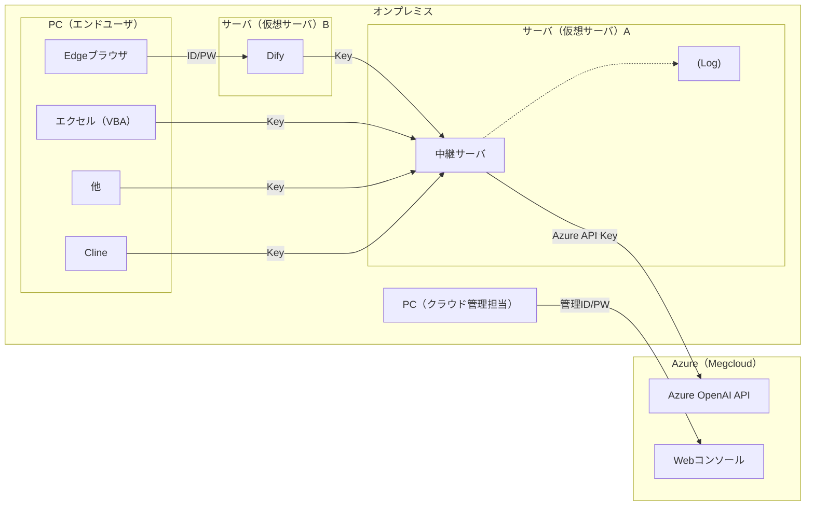

- Azure (Megcloud)
    - OpenAI API
    - Webコンソール

- オンプレミス
    - PC（クラウド使用者）
    - サーバ（仮想サーバ）
        - 中継サーバ

    - サーバ（仮想サーバ）
        - Dify
    
    - PC（エンドユーザ）
        - エクセル（VBA）
        - Cline
        - 他

